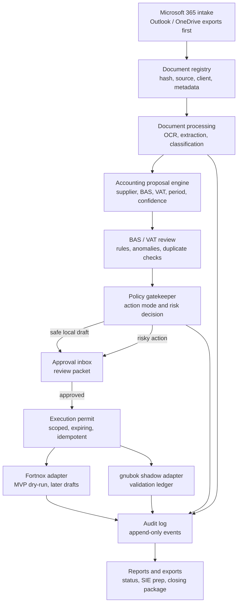
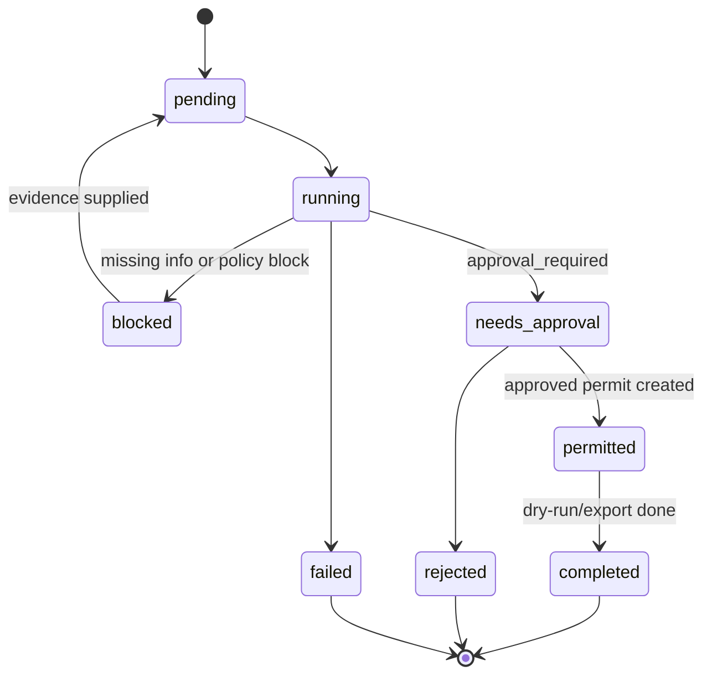

# Accounting Agent Architecture

Generated: 2026-05-16

Target repository: this repository.

Status: v1 synthetic/local control-plane foundation plus architecture history.
The workspace now contains typed accounting controls, entity-scoped local
pipelines, evidence-bound approvals, resumable preparation agents, guarded read
contracts, dry-run adapters, tests, and demos. No production integration, live
Fortnox write, email send, payment, tax filing, or real client-data processing
is allowed in this workspace.

## Current State

The target workspace is no longer an empty seed folder. It now contains the v1
Sweden-first synthetic/local foundation with synthetic fixtures, a supplier
invoice autopilot, policy and execution permits, a dry-run Fortnox boundary, a
restricted Fortnox MCP facade, a Microsoft 365 local intake prototype, Hermes
approval packets, Openclaw-style risk findings, a gnubok shadow-ledger stub, a
bank-reconciliation prototype, and a one-command local demo.

A pre-existing internal governance prototype informed the policy gates, SQLite
task queue, agent-role vocabulary, approvals, audit expectations, and reporting
patterns. That prototype is not part of this repository or the release. The
accounting-agent repository keeps its own finance/client-data boundary and only
borrows the general governance pattern.

The accounting system should therefore be its own repo with a narrow finance/client-data boundary, while borrowing the governance pattern:

- SQLite queue as executable local source of truth
- explicit action modes
- policy gate before external or risky work
- append-only audit trail
- approval packets for human decisions
- Openclaw/Hermes/Codex role split as operating roles, not as permission bypasses

## Inspection Findings

Current repo contents include:

- `AGENTS.md`: repo-local accounting safety rules.
- `README.md` and `pyproject.toml`: local package and CLI entrypoint.
- `accounting_agent/policy.py`: deterministic policy decisions and permission modes.
- `accounting_agent/permits.py`: execution permits, payload hashes, idempotency keys, policy re-checks, and in-memory/SQLite-compatible permit stores.
- `accounting_agent/adapters/fortnox.py`: read-first Fortnox adapter with dry-run default, protected payload shaping, permit/idempotency gates, and no final posting/payment/approval path.
- `accounting_agent/restricted_fortnox_mcp.py`: mocked restricted tool facade for agent-facing Fortnox access.
- `accounting_agent/intake/*`: local/mock Microsoft 365-style intake and duplicate detection.
- `accounting_agent/supplier_invoice/*`: fixture-driven supplier invoice pipeline and approval packet generation.
- `accounting_agent/hermes.py`: Markdown approval packets and draft-only missing-info email text.
- `accounting_agent/risk_review.py` and `accounting_agent/workflow.py`: structured Openclaw-style risk findings before policy decisions.
- `accounting_agent/adapters/gnubok.py`: local shadow-ledger validation stub.
- `accounting_agent/bank_reconciliation/*`: fixture-only bank reconciliation proposal prototype.
- `accounting_agent/local_demo.py`: one-command synthetic Supplier Invoice Autopilot demo.
- `tests/`: local unit and integration coverage for the current v1 surfaces.

No production runtime integration exists in this repo:

- no live Microsoft Graph adapter
- no live Fortnox credentialed run is allowed for the v1 preview
- no email sender
- no payment, tax filing, final voucher posting, supplier invoice approval, deletion, or settings-change implementation
- no real client documents or tracked secrets should be present

This folder now has a local Git baseline and implementation checkpoint. It has
not been published and still contains no production integration authority.

Important mismatch to preserve:

- Openclaw/Hermes can be reused as a governance pattern and role vocabulary.
- Openclaw/Hermes must not become the production accounting ledger or hidden execution lane.
- Obsidian, if used later, stays a read-only/export-only mirror and must not become the executable task queue.

## External Constraints Checked

These constraints should be rechecked before live integration work, but they are current enough for this architecture pass:

- Fortnox API is REST/OAuth based, has supplier invoice, voucher, bookkeeping, SIE, file-connection, inbox, and payment-related resources, and documents rate limits. Fortnox also states that API scopes grant both read and write access to an endpoint; there is no read-only API scope for a granted resource. Therefore this architecture treats Fortnox "read-only" as an application-level policy enforced by our adapter, token handling, and execution permits, not as a Fortnox scope guarantee.
- Microsoft Graph can read mail and files with scoped permissions such as `Mail.Read`/`Files.Read`, but broad tenant/file permissions exist and must be avoided for MVP. Sending mail (`Mail.Send`) and read-write file scopes belong behind approval/escalation, not routine intake.
- BAS-kontoplanen is a general Swedish chart of accounts for systematic coding of business events and is updated annually. BAS rules in this repo must therefore be versioned as rules data, not hard-coded forever.
- Skatteverket states that bookkeeping responsibility remains with the business, bookkeeping should have verifications for entries, accounting information must be retained in an orderly and safe way, and VAT declarations can be submitted via accounting software/API or e-service but still require the proper authorized signing flow. This architecture keeps VAT/tax filing out of MVP.
- SIE is the Swedish de facto standard for accounting-data transfer; SIE type 4i is relevant for transaction/voucher import from pre-systems, and SIE 5 adds XML, richer metadata, electronic document references, and integrity features. MVP should only prepare/export draft SIE artifacts after approval, not treat SIE as the production ledger.
- gnubok from erp-mafia is an actively developed open-source ERP/bookkeeping system built specifically for Sweden. In this architecture it is a shadow ledger and validation lab only.
- Capego Bokslut supports SIE import and has Fortnox-related closing/reporting workflows. Capego support is therefore planned as a closing/tax export lane, not as an MVP production bookkeeping dependency.

## System Diagram

## Operating Roles

| Role | Purpose | Allowed in MVP | Not allowed in MVP |
| --- | --- | --- | --- |
| Openclaw | Research, anomaly detection, risk review, rule improvement suggestions | Flag unusual suppliers, VAT mismatches, duplicate documents, weak evidence | Approve its own findings, write to Fortnox, contact clients |
| Hermes | Client communication and approval summaries | Draft missing-info requests and human-readable approval summaries | Send client messages without explicit approval |
| Codex | Implementation, integration tests, local automation | Build modules, tests, adapters, docs, local fixtures | Touch production credentials, deploy live writes without approval |
| Policy Gatekeeper | Deterministic authority boundary | Decide action mode, require approvals, block forbidden actions | Self-approval or hidden policy overrides |
| Accounting Reviewer | Human or future reviewer role | Approve/reject packets and execution permits | Bypass audit logging |

## Module Boundaries

Planned package root: `accounting_agent/`

| Layer | Proposed files/modules | Responsibility |
| --- | --- | --- |
| Queue | `accounting_agent/queue.py`, `accounting_agent/schema.py`, `migrations/001_initial.sql` | SQLite tasks, statuses, events, approvals, idempotency keys |
| Intake | `accounting_agent/intake/m365_export.py`, `accounting_agent/intake/watch_folder.py` | Read local Outlook/OneDrive exports or approved local folders first |
| Document registry | `accounting_agent/documents/registry.py`, `accounting_agent/documents/hash.py` | Store document identity, source, hashes, duplicates, metadata |
| OCR/extraction | `accounting_agent/documents/ocr.py`, `accounting_agent/documents/extract.py` | OCR abstraction, text extraction, invoice/receipt fields |
| Proposal engine | `accounting_agent/accounting/proposals.py`, `accounting_agent/accounting/supplier_history.py` | Draft voucher/supplier-invoice proposals with confidence and evidence |
| BAS/VAT review | `accounting_agent/accounting/bas.py`, `accounting_agent/accounting/vat.py`, `rules/bas_accounts.yaml`, `rules/vat_rules.yaml` | Deterministic checks for account/VAT/period consistency |
| Policy gate | current: `accounting_agent/policy.py`; later split: `accounting_agent/policy/actions.py`, `accounting_agent/policy/engine.py`, `policies/action_policy.yaml` | Convert proposed work into action modes and approval requirements |
| Execution permit | current: `accounting_agent/permits.py`; later split: `accounting_agent/execution/permits.py` | Scoped approvals with expiry, target system, permitted action, idempotency key |
| Fortnox adapter | current stub: `accounting_agent/external_writes.py`; later split: `accounting_agent/adapters/fortnox.py` | MVP dry-run/read-only interface; later draft supplier invoice/voucher creation |
| gnubok adapter | `accounting_agent/adapters/gnubok.py` | Shadow-ledger export/validation lab, not production source of truth |
| Approval inbox | `accounting_agent/approvals/inbox.py`, `accounting_agent/approvals/packets.py` | Review packets, missing-info requests, accept/reject records |
| Audit log | `accounting_agent/audit/log.py` | Append-only audit events with redaction and no secret values |
| Reporting/export | `accounting_agent/reports/status.py`, `accounting_agent/exports/sie.py` | Daily status, blocked items, SIE prep, future Capego package |
| CLI | `accounting_agent/cli.py` | Local operator commands for init, ingest, propose, review, export |
| Tests | `tests/` | Policy, queue, idempotency, proposals, adapters, no-secret checks |

## SQLite Source Of Truth

Use SQLite as the executable local queue and audit database. Suggested runtime path:

`./.local/accounting_agent.sqlite`

This file should be ignored by git. The schema should include:

- `tasks`: task queue with client id, intent, status, priority, risk, assigned role, output refs
- `task_events`: append-only task state transitions
- `documents`: source document records, hashes, metadata, storage refs, duplicate status
- `extracted_fields`: OCR and parsing output with confidence and evidence refs
- `accounting_proposals`: draft vouchers, draft supplier invoices, BAS/VAT suggestions, confidence
- `policy_decisions`: action mode, reason, risk factors, gate result
- `approval_requests`: review packets and approval state
- `execution_permits`: approved scoped actions, expiry, idempotency key, target adapter
- `adapter_events`: Fortnox/gnubok dry-run or execution results
- `audit_events`: append-only high-level audit log
- `idempotency_keys`: prevent duplicate external drafts or exports
- `export_jobs`: SIE/Capego/reporting export jobs

Minimum task lifecycle:

Status changes must write both a normalized task row update and an append-only `task_events`/`audit_events` entry. The queue database is the executable source of truth; Markdown reports are generated views.

## Autonomy Policy

Action modes:

- `auto_allowed`: local, reversible, non-client-sensitive work such as indexing approved fixture files, recomputing hashes, running tests, or generating draft-only local proposals.
- `draft_only`: proposal generation, Hermes message drafts, missing-info summaries, report drafts, and dry-run/no-live draft adapter payloads.
- `approval_required`: a future policy category for actions such as creating an
  external draft or sending a client message. The current Fortnox adapter does
  not implement or enable that live path; local proposals and dry-runs only are
  in scope.
- `escalation_required`: tax filing, broad Microsoft tenant access, permission changes, client onboarding beyond the approved pilot, and other high-risk actions that are not explicitly forbidden.
- `forbidden`: storing secrets in repo, self-approval, hidden live writes, final voucher posting, invoice sending, supplier invoice approval, payments, destructive ledger changes, deleting audit logs, bypassing idempotency, using Obsidian as the operational queue.

MVP rule: external accounting drafts, tax/file-prep, client-sensitive work, and communication actions require approval or escalation. Final posting, invoice sending, supplier-invoice approval, payments, deletes, settings changes, and hidden live writes are forbidden.

## MVP Scope

### MVP 1: Local Proposal Engine

Goal: prove the queue, intake, proposal, policy, approval, and audit loop with local files only.

Build:

- repo scaffold and local instructions
- SQLite queue and audit schema
- local M365 export intake from approved folders
- document hashing and duplicate detection
- OCR/extraction abstraction with fixture-based tests
- accounting proposal schema for supplier invoices and vouchers
- BAS/VAT deterministic review rules
- policy gatekeeper and approval packet generation
- dry-run Fortnox payload shape, no API writes
- gnubok shadow export stub or fixture adapter
- status report with counts: ingested, proposed, missing info, blocked, approved, exported

Do not build:

- live Fortnox writes
- live Microsoft Graph ingestion
- payments
- tax filings
- generic SaaS tenancy
- broad ERP workflows

### MVP 2: Read-Only Integrations And Draft Adapters

Goal: connect real systems with read-only or draft-only authority.

Build:

- Microsoft Graph read-only inbox/OneDrive adapter after approved scopes
- Fortnox read-only/sandbox adapter
- Fortnox supplier-invoice draft adapter behind execution permits; voucher payloads stay dry-run until Fortnox draft-only semantics are proven
- gnubok validation import/export with reconciliation report
- approval inbox CLI or small local web view
- SIE draft export for closing prep
- client-isolated runtime directories and per-client config templates

### Later

Add only after MVP 1 and 2 are proven:

- Capego-specific closing package workflow
- richer OCR/document AI
- supplier history learning
- bank reconciliation and payment proposal review
- multi-client operations
- hosted UI
- continuous scheduler
- live client communication after approval policy is proven

## Risk Controls

Security:

- no secrets in tracked files
- `.env`, OAuth tokens, Fortnox credentials, raw client documents, and runtime SQLite databases must be ignored
- config files in git contain names of required settings, not values
- raw documents stored under client-isolated ignored paths
- audit events store references and redacted summaries, not raw secrets or full private document text

Permissions:

- Fortnox starts dry-run/read-only
- Microsoft 365 starts with local exports, then read-only Graph scopes
- gnubok is shadow validation only
- Capego/SIE is export prep only until explicitly implemented

Approval gates:

- no self-approval
- every reviewed execution permit must point to an exact immutable approval
  request; zero-review draft permits carry no approval receipt
- every permit carries a separate explicit entity id; client-to-entity fallback
  is forbidden
- permits expire and are scoped to one adapter/action/client/entity/document set
- rejected or expired approvals leave tasks blocked with a reason

Idempotency:

- document hashes prevent duplicate intake
- proposal keys combine client, source document hash, supplier id, amount, date, and proposed action
- external adapter calls require an idempotency key
- dry-run payloads are stored before any future live execution
- repeated runs update existing tasks/proposals instead of duplicating them

Audit:

- log task id, role, action mode, policy decision, files/systems touched, result, approval ref, rollback note
- audit logs are append-only in normal operation
- tests must assert that risky actions cannot execute without a permit

## Historical Implementation Sequence

This section is retained as planning history from the initial MVP-0. The v1 implementation
has already completed or superseded parts of these phases; use the "Current
State" and feature-specific docs as the source of truth for what exists now.

Phase 0: repo foundation

- create `AGENTS.md`
- create `README.md`
- create `pyproject.toml`
- create `.gitignore`
- create `accounting_agent/__init__.py`
- create `accounting_agent/cli.py`
- create `docs/` architecture and inventory docs
- optionally initialize git after confirming with the operator if the folder is still not a repo

Phase 1: queue and audit core

- create `migrations/001_initial.sql`
- create `accounting_agent/db.py`
- create `accounting_agent/schema.py`
- create `accounting_agent/queue.py`
- create `accounting_agent/audit/log.py`
- create tests in `tests/test_queue.py` and `tests/test_audit_log.py`

Phase 2: policy and approvals

- create `policies/action_policy.yaml`
- create `accounting_agent/policy/actions.py`
- create `accounting_agent/policy/engine.py`
- create `accounting_agent/approvals/packets.py`
- create `accounting_agent/approvals/inbox.py`
- create tests in `tests/test_policy_engine.py` and `tests/test_approvals.py`

Phase 3: local intake and document registry

- create `accounting_agent/intake/m365_export.py`
- create `accounting_agent/intake/watch_folder.py`
- create `accounting_agent/documents/hash.py`
- create `accounting_agent/documents/registry.py`
- create `tests/fixtures/documents/`
- create tests in `tests/test_document_registry.py` and `tests/test_m365_export_intake.py`

Phase 4: proposal engine

- create `rules/bas_accounts.yaml`
- create `rules/vat_rules.yaml`
- create `accounting_agent/documents/extract.py`
- create `accounting_agent/accounting/proposals.py`
- create `accounting_agent/accounting/bas.py`
- create `accounting_agent/accounting/vat.py`
- create tests in `tests/test_accounting_proposals.py` and `tests/test_vat_rules.py`

Phase 5: adapters and reports

- create `accounting_agent/adapters/fortnox.py`
- create `accounting_agent/adapters/gnubok.py`
- create `accounting_agent/exports/sie.py`
- create `accounting_agent/reports/status.py`
- create tests in `tests/test_fortnox_dry_run.py`, `tests/test_gnubok_shadow.py`, and `tests/test_status_report.py`

## Historical First Implementable Module

This was the original first-module contract and is no longer the next goal.
It is retained to show the bootstrap acceptance criteria that shaped the repo.

The original next Codex goal was to implement Phase 0 and Phase 1 only:

- initialize the repo skeleton
- add ignored runtime paths
- create the SQLite schema
- implement queue init/add/list/show/status transitions
- implement append-only audit events
- add tests proving that task and audit records are persisted locally

This gives the accounting-agent system an executable backbone before any Fortnox, Microsoft, OCR, or client-data integration is touched.

Concrete next-goal file contract:

| File | Create/modify | Minimum contents |
| --- | --- | --- |
| `AGENTS.md` | Create | repo-local finance/client-data safety rules, no-secret rule, approval boundaries |
| `README.md` | Create | local-first MVP description, CLI examples, non-goals |
| `.gitignore` | Create | `.env*`, `.local/`, raw client docs, tokens, caches, build output |
| `pyproject.toml` | Create | Python package metadata, pytest config, console script if useful |
| `accounting_agent/__init__.py` | Create | package marker and version |
| `accounting_agent/db.py` | Create | SQLite connection helper, migration runner, local DB path resolution |
| `accounting_agent/schema.py` | Create | typed constants/enums for task status, action modes, risk levels |
| `accounting_agent/queue.py` | Create | add/list/show/update task operations with idempotency key support |
| `accounting_agent/audit/log.py` | Create | append-only audit event writer and query helper |
| `accounting_agent/cli.py` | Create | `init-db`, `task add`, `task list`, `task show`, `task status`, `audit tail` |
| `migrations/001_initial.sql` | Create | tables for tasks, task_events, audit_events, idempotency_keys |
| `tests/test_queue.py` | Create | persistence, duplicate idempotency key, status transitions |
| `tests/test_audit_log.py` | Create | append-only audit events and no secret values in sample events |

First-module acceptance criteria:

- `python -m accounting_agent.cli init-db` creates `./.local/accounting_agent.sqlite`.
- A task can be added, listed, shown, and moved through an allowed status transition.
- Every task creation and status change writes an audit event.
- Re-running task creation with the same idempotency key does not create a duplicate.
- Tests run locally without Fortnox, Microsoft, gnubok, OCR, Capego, or internet access.
- No fixture or config file contains credentials, tokens, client documents, or live company identifiers.

## Reference Links

- Fortnox API documentation: <https://apps.fortnox.se/apidocs>
- Fortnox scopes: <https://www.fortnox.se/developer/guides-and-good-to-know/scopes>
- Microsoft Graph permissions reference: <https://learn.microsoft.com/en-us/graph/permissions-reference>
- BAS kontoplan overview: <https://www.bas.se/kontoplaner/allmant-om-kontoplanen/>
- Skatteverket bookkeeping requirements: <https://www.skatteverket.se/foretag/drivaforetag/bokforingochbokslut/bokforingvadkraverlagen.4.18e1b10334ebe8bc80005195.html>
- Skatteverket VAT declaration overview: <https://skatteverket.se/foretag/moms/deklareramoms.4.7459477810df5bccdd480006935.html>
- SIE format documentation: <https://sie.se/format/>
- gnubok product/source overview: <https://www.gnubok.se/>
- Capego SIE import support: <https://support.wolterskluwer.se/support-enkelsida-manual/capego/capego-overgang-fran-annat-bokslutsprogram>
