# Accounting Agent v1 — platform foundation and future contract

The filename is retained for historical links; this document describes the
shipped v1 foundation and clearly labels future integration work.

Status: functional local foundation for synthetic data. Not a production
accounting system, tax engine, filing service, or live ERP connector.

## Product promise

Accounting Agent should remove repetitive collection, checking, comparison,
drafting, reconciliation, and evidence-packaging work while keeping accounting
judgment with an identified human. The interface presents one accounting case
and one next decision; operators do not have to manage an invisible swarm.

The first validated market is Sweden. International support means a common
money/evidence/provider schema plus versioned jurisdiction packs. It does not
mean that one generic rule set is compliant in every country.

## Current execution boundary

The repository can:

- ingest deterministic local fixtures;
- extract and normalize basic invoice data;
- detect duplicates and supplier/VAT risks;
- propose BAS/VAT treatment for the Swedish sample pack;
- propose bank reconciliation matches;
- generate review packets, audit artifacts, and ERP-shaped dry-run payloads;
- show the result in a local guided/expert cockpit.

The repository cannot:

- process real client documents or credentials;
- make live Fortnox, NetSuite, Oracle, SAP, Microsoft Graph, email, tax, filing,
  payment, approval, delete, or settings calls;
- let an agent approve its own work or broaden its permissions;
- treat a computer-use session as accounting authority.

Every unknown or inconsistent capability fails closed.

## Entity identity and upgrade safety

Client IDs are opaque, Unicode-normalized, case-sensitive identifiers. Local
storage uses a reversible versioned base32 key, so path-hostile IDs such as
`a/b` and `a?b`, and case variants such as `Client-A` and `client-a`, cannot
share a folder even on a case-insensitive filesystem.

The local supplier queue uses schema version 3 with explicit client and legal-
entity ownership on every case, document, extracted-field, proposal, decision,
packet, and audit row. Duplicate history is queried by both identities. An
older unscoped row is a hard review stop: schema migration adds nullable scope
columns but never assigns an owner or discloses the old case ID or source path.
Client-only mapping is forbidden. After independently verifying provenance, an
operator may use `LocalQueue.map_legacy_rows_to_entity()` with both exact IDs;
partial or conflicting mappings are refused transactionally.

Evidence passed to a specialist plan uses typed `EvidenceReference` values
bound to the exact entity, URI, optional SHA-256, and evidence budget. Unknown
currency precision also fails closed: the code retains the extracted currency
for review but does not invent a minor-unit amount.

## Case flow

```mermaid
flowchart LR
    A["Entity-scoped intake"] --> B["Evidence-preserving extraction"]
    B --> C["Supplier and duplicate risk"]
    C --> D["Jurisdiction and VAT proposal"]
    D --> E["Accounting-entry proposal"]
    E --> F["Reconciliation proposal"]
    F --> G["Strict policy merge"]
    G --> H["Human review inbox"]
    H --> I["Local simulation or export"]
    I --> J["Evidence packet and independent verification"]
```

The strictest result wins. A policy disagreement, missing evidence, uncertain
VAT, changed supplier bank details, unknown supplier, or possible duplicate
moves the case to review. It never silently degrades to a more permissive mode.

## Bounded specialist agents

The coordinator may prepare a deterministic plan for these specialists:

1. Intake and classification
2. Extraction with evidence references
3. Supplier, duplicate, and anomaly risk
4. Tax and jurisdiction proposal
5. Accounting-entry proposal
6. Reconciliation proposal
7. Evidence-packet builder
8. Independent verifier

Each specialist receives the same entity, jurisdiction, provider, evidence,
budget, deadline, and stop conditions. Its output is a typed proposal. It has no
provider credential, approval record, execution permit, or way to elevate its
authority. Invalid schemas and disagreements are retained for review, not
overwritten.

OpenClaw contributes the queue, risk-review, deny-unknown, and audit patterns.
Hermes contributes human-readable review and missing-information packets. Codex
or another implementation agent can build and test local code. None of those
roles is the ledger or an approval authority.

## Human roles and interface modes

The same case model supports:

- small-firm accountant — compact daily queue and clear next action;
- accountant — evidence, coding, and exception review;
- senior accountant — policy conflicts, judgment, and escalation;
- financial controller — close, reconciliation, variance, and control evidence;
- auditor — provenance, decisions, change history, and exportable support;
- agent operator — specialist plan, capability envelope, budgets, and traces.

Guided mode explains the decision in accounting language and hides raw payloads.
Expert mode exposes identifiers, policy reasons, provider capabilities, and
evidence artifacts. Both modes show the same underlying state and safety gates.
The interface labels the role control as a guidance perspective because it does
not reorder risk or change policy authority.

Privately supplied course material may be indexed under
`.local/course_reference/` for topic-coverage checks and synthetic-fixture
ideation. Source PDFs and extracted text are excluded from Git, are not copied
into reports, and never override current official sources.

## Sweden pack

The Sweden pack is effective-dated and records, rather than assumes, its source
versions. Its foundation includes:

- entity country `SE`, functional currency `SEK`, and `sv-SE` / `en-GB` UI;
- BAS 2026 chart metadata;
- SIE 4C and Peppol BIS Billing 3 / EN 16931 interoperability metadata;
- seven-year retention and Sweden-storage defaults;
- a human-review rule for uncertain, exempt, reverse-charge, import, OSS, and
  cross-border VAT;
- an effective date for the temporary 6% Swedish food VAT rate from 2026-04-01,
  while restaurant/café service remains separately classified.

The Swedish Bookkeeping Act requires verifications, system documentation and
processing history, preservation of original electronic format/content, and
retention through the seventh year after the calendar year in which the fiscal
year ended. Those are architecture requirements; the current fixture runtime
does not yet implement a compliant records archive. Sources:

- [Swedish Bookkeeping Act (1999:1078)](https://www.riksdagen.se/sv/dokument-och-lagar/dokument/svensk-forfattningssamling/bokforingslag-19991078_sfs-1999-1078/)
- [BFNAR 2013:2 bookkeeping guidance](https://www.bfn.se/redovisningsregler/beslutade-redovisningsregler/)
- [Skatteverket VAT rates and exemptions](https://www.skatteverket.se/foretag/moms/saljavarorochtjanster/momssatserochundantagfranmoms.4.58d555751259e4d66168000409.html)
- [BAS 2026 chart of accounts](https://www.bas.se/kontoplaner/)
- [SIE file format, edition 4C](https://sie.se/wp-content/uploads/2026/02/SIE_filformat_ver_4C_2025-08-06.pdf)

## International core

The international core records ISO 3166 country, ISO 4217 currency and minor
units, BCP 47 locale, functional and transaction currencies, tax registration,
tax point, exchange-rate evidence, dimensions, and posting book. A country pack
must supply effective-dated tax and reporting rules before any compliance claim.

Peppol PINT, ISO 20022, additional SIE versions, and local e-invoicing/reporting
formats are extension points. Currency parsing supports common Swedish and
international separators and currencies with zero or three minor units, but
that parser is not an exchange-rate or tax engine.

Interoperability reference: [OpenPeppol PINT and BIS Billing identifiers](https://docs.peppol.eu/poac/docs/pintdocs/pint/guide/).

## Provider-neutral ERP contract

Providers declare capabilities; the coordinator never infers them from a brand
name. The safe foundation can describe discovery, schema inspection, read,
staged import, raw export, local validation, local draft preparation, and local
simulation. External post, approve, send, pay, file, delete, and settings-change
capabilities remain forbidden.

Executable connector reads have one contract boundary:
`read_connector_page_guarded`. Before invoking an adapter once, it verifies the
adapter/manifest provider, exact tenant/company/environment/auth binding, an
available read capability, page-size limit, and request cursor. Environment is
required and normalized to the closed `local`, `sandbox`, or `production`
vocabulary inside the immutable `ConnectorBinding`; it is also included in the
serialized binding envelope. After the call, the gateway rejects adapter scope
or environment drift and any returned provider, binding, schema version,
mapping version, or cursor outside that preflight contract. This prevents a
sandbox request from being satisfied by production-scoped adapter state (and
vice versa). The tests use deterministic fixture and adversarial adapters only.
This gateway does not configure a live connection, supply credentials, enable
any write, or turn the declaration-only NetSuite, Oracle, SAP, Odoo, SIE, or CSV
manifests into implemented connectors.

| Provider | Current v1 status | Intended first integration |
| --- | --- | --- |
| Fortnox | local declaration + existing mocked dry run | reference/master reads in a separately approved sandbox |
| NetSuite | declaration only | OAuth 2.0 role-scoped metadata and read-only SuiteQL |
| Oracle Fusion Cloud Financials | declaration only | versioned REST metadata and invoice reads |
| SAP S/4HANA Cloud | declaration only | journal/supplier-invoice observation APIs |
| Generic | local import/export declaration | CSV, JSON, SIE, Peppol validation fixtures |

Official provider references:

- [Fortnox API](https://apps.fortnox.se/apidocs)
- [NetSuite OAuth 2.0](https://docs.oracle.com/en/cloud/saas/netsuite/ns-online-help/chapter_157769826287.html)
- [NetSuite SuiteQL](https://docs.oracle.com/en/cloud/saas/netsuite/ns-online-help/section_156257799794.html)
- [Oracle Fusion Cloud Financials invoice REST endpoints](https://docs.oracle.com/en/cloud/saas/financials/26a/farfa/api-invoices.html)
- [SAP S/4HANA Cloud journal-entry service](https://help.sap.com/docs/SAP_S4HANA_CLOUD/b978f98fc5884ff2aeb10c8fdeb8a43b/f5c8d0579212c525e10000000a4450e5.html)

## Computer-use boundary

Computer use is a supervised fallback for observation, evidence capture, local
UI testing, and preparing a human-readable action plan when no suitable API or
file export exists. It receives an exact domain/task allowlist and a short
budget. It must stop on credentials, prompt-injection indicators, unexpected
navigation, submit/autosave behavior, or any consequential action.

It cannot type into a remote ERP field that may autosave, click submit/post/
approve/send/pay/delete/settings, handle tax filing, or communicate with a
client. OS accessibility permission does not grant accounting authority.
OpenAI's own computer-use material emphasizes confirmation for side effects,
active supervision on sensitive sites, and prompt-injection defenses:

- [Computer-Using Agent safety](https://openai.com/index/computer-using-agent/)
- [Understanding prompt injections](https://openai.com/safety/prompt-injections/)

## Next production gates

Before any real-client pilot, the platform still needs:

1. one migrated entity-scoped repository for cases, evidence, policy, reviews,
   connector artifacts, and append-only events;
2. encrypted storage, retention/disposal controls, access logs, backup/restore,
   and tested client isolation;
3. canonical effective-dated policy and jurisdiction engines;
4. provider sandboxes with least-privilege identities and independently verified
   observed-call counters;
5. signed reviewer identity and approval records bound to exact entity,
   provider, environment, capability, payload hash, and expiry;
6. security/threat-model, privacy, legal, accessibility, and accountant/auditor
   acceptance reviews.

The safe default remains local evidence, proposal, review, and export. Live
execution is a later, separately authorized product phase.
